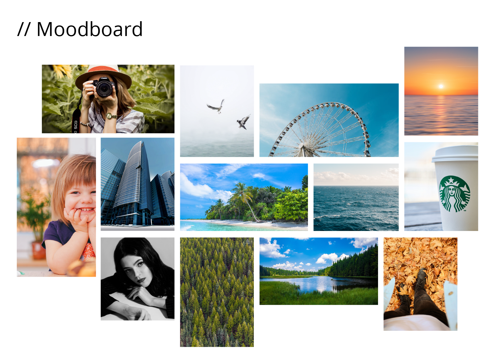
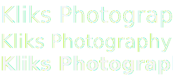
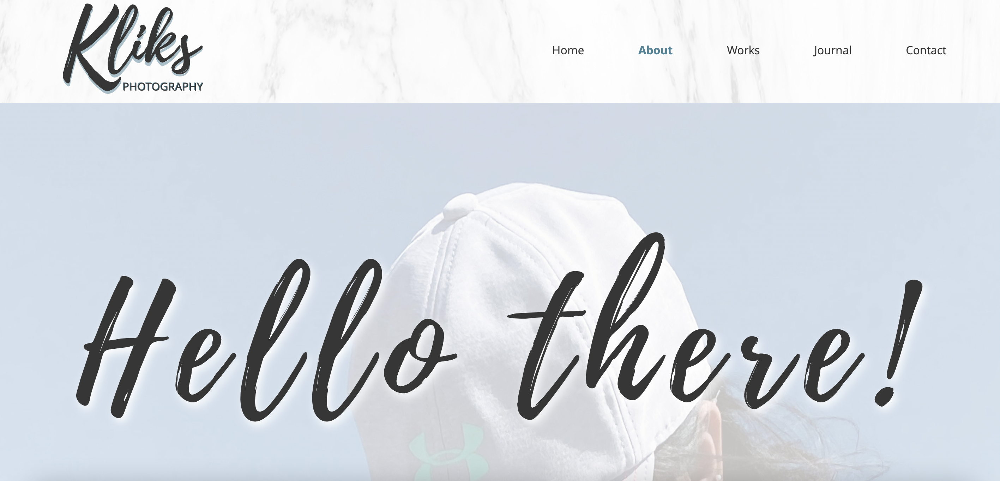

# Kliks Photography - Final Integrated Project

This will be the structure of the website which will house all the photographs that I took from travel and events. It will also display portrait and landscape shoots as well.

## Moodboard

## Fonts

## MarkUp Language and Styling Sheet
- HTML
- CSS

## Homepage

## About Page

## Works

## Journal

## Contact Us

## Contributing

1. Fork it!
2. Create your feature branch: `git checkout -b my-new-feature`
3. Commit your changes: `git commit -am 'Add some feature'`
4. Push to the branch: `git push origin my-new-feature`
5. Submit a pull request :D

## Credits

* Prof Trev who patiently taught us and shared knowledge in a very detailed way
* All of my Professors from differet subjects
    * Prof Justin
    * Prof Rob
    * Prof Jarrod
* Some links from FOL
    * [30 seconds of code](https://www.30secondsofcode.org/articles/s/css-units-cheatsheet)
    * [The CSS Box Model](https://css-tricks.com/the-css-box-model/)

## License

Kliks Photography © 2021
Dianne Karla Trabuco

